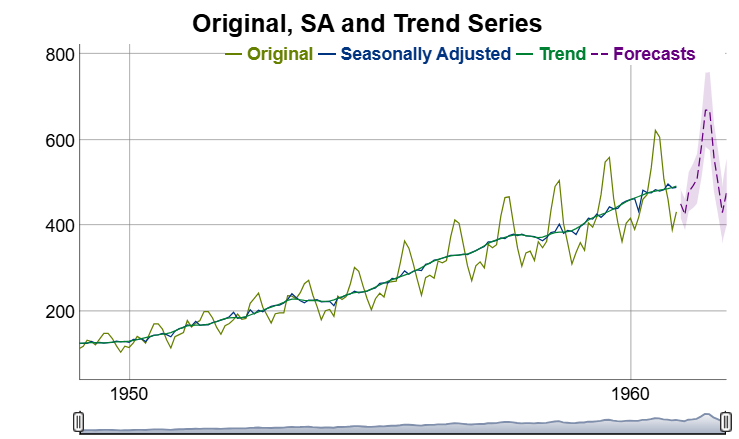

<!-- README.md is generated from README.Rmd. Please edit that file -->

```{r setup, include = FALSE}
knitr::opts_chunk$set(
  collapse = TRUE,
  comment = "#>",
  fig.path = "man/figures/README-",
  out.width = "90%"
)
```
# persephone3

[](https://github.com/statistikat/persephone3/actions)
[](https://www.tidyverse.org/lifecycle/#experimental)
[](https://github.com/statistikat/persephone3)
[](https://github.com/statistikat/persephone3/commits/master)
[](https://app.codecov.io/gh/statistikat/persephone3?branch=master)


Object oriented wrapper around the seasonal adjustment packages in the [rjdverse](https://github.com/rjdverse/).
The package performs time series adjustments with the java library [JDemetra+](https://jdemetra-new-documentation.netlify.app/) and focuses on batch processing,
hierarchical time series and analytic charts.

## Installation

The following commands install `persephone3` as well as the packages from the [rjdverse](https://github.com/rjdverse/) that talk with the java interface.

``` r
# install dependencies
remotes::install_github("rjdverse/rjd3toolkit@*release")
remotes::install_github("rjdverse/rjd3x13@*release")
remotes::install_github("rjdverse/rjd3tramoseats@*release")

# install the package from GitHub
remotes::install_github("statistikat/persephone3")
```

## Usage

Objects can be constructed with `perX13()` or `perTramo()`. Subsequently,
the `run()` method runs the model and `output` gives access to the output object from
`rjd3x13::x13_fast()` or `rjd3tramoseats::tramoseats_fast()`.

```{r, message = FALSE}
library(persephone3)
```
```{r}
# construct a seasonal adjustment object for the AirPassengers dataset
obj <- perX13(AirPassengers)

# run the model
obj$run()

# access the preprocessing slot of the rjd3 output object
obj$output$preprocessing
```

```{r, message = FALSE, eval = FALSE}
# visualize the results
obj$plot()
```



## Further reading

This section still needs an update to persephone3.

More information can be found on the [github-pages site] for persephone.

* An overview of the package is available in the [useR!2019 slides].
* The [plotting vignette] contains examples of interactive plots htat can be
  created with `persephone`.
* More information about hierarchical time series can be found in the
  [hierarchical timeseries vignette].

[rjdverse]: https://github.com/rjdverse
[github-pages site]: https://statistikat.github.io/persephone3/
[plotting vignette]: https://statistikat.github.io/persephone3/articles/persephone-plotting.html
[hierarchical timeseries vignette]: https://statistikat.github.io/persephone3/articles/persephone-hierarchical.html
