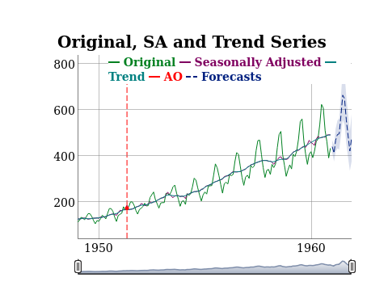

<!-- README.md is generated from README.Rmd. Please edit that file -->

# persephone3

[](https://travis-ci.org/statistikat/persephone)
[](https://www.tidyverse.org/lifecycle/#experimental)
[](https://github.com/statistikat/persephone)
[](https://github.com/statistikat/persephone/commits/master)
[](https://coveralls.io/r/statistikat/persephone?branch=master&service=github)

Object oriented wrapper around the seasonal adjustment packages in the
[rjdverse](https://github.com/rjdverse/). The package performs time
series adjustments with the java library
[JDemetra+](https://jdemetra-new-documentation.netlify.app/) and focuses
on batch processing, hierarchical time series and analytic charts.

## Installation

The following commands install `persephone3` as well as the packages
from the [rjdverse](https://github.com/rjdverse/) that talk with the
java interface.

``` r
# install dependencies
remotes::install_github("rjdverse/rjd3toolkit@*release")
remotes::install_github("rjdverse/rjd3x13@*release")
remotes::install_github("rjdverse/rjd3tramoseats@*release")

# install the package from GitHub
remotes::install_github("statistikat/persephone/tree/persephone3")
```

## Usage

Objects can be constructed with `perX13()` or `perTramo()`.
Subsequently, the `run()` method runs the model and `output` gives
access to the output object from `rjd3x13::x13_fast()` or
`rjd3tramoseats::tramoseats_fast()`.

``` r
library(persephone) #change to persephone3 at some point, still working on some issues
# construct a ts-model object
obj <- perX13(AirPassengers)
# run the model
obj$run()
# access the preprocessing slot of the rjd3 output object
obj$output$preprocessing
#> NULL
# visualize the results 
obj$plot() # change to hchart some time
```



## Further reading

This section still needs an update to persephone3.

More information can be found on the [github-pages
site](https://statistikat.github.io/persephone/) for persephone.

- An overview of the package is available in the [useR!2019
  slides](https://statistikat.github.io/persephone/articles/persephone-useR.pdf).
- The [plotting
  vignette](https://statistikat.github.io/persephone/articles/persephone-plotting.html)
  contains examples of interactive plots htat can be created with
  `persephone`.
- More information about hierarchical time series can be found in the
  [hierarchical timeseries
  vignette](https://statistikat.github.io/persephone/articles/persephone-hierarchical.html).
